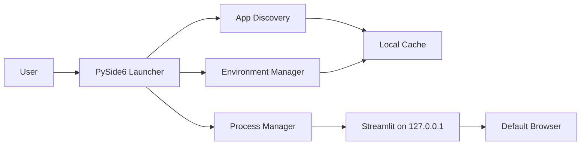
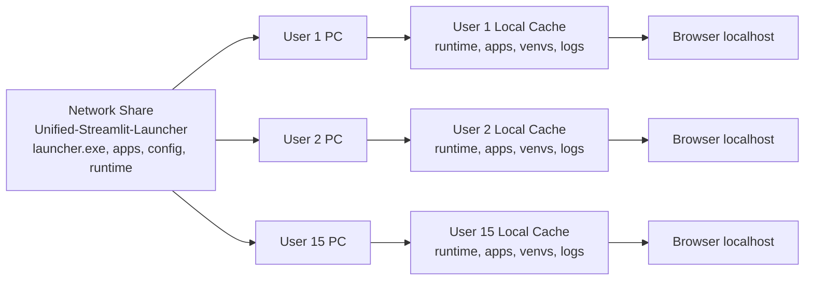
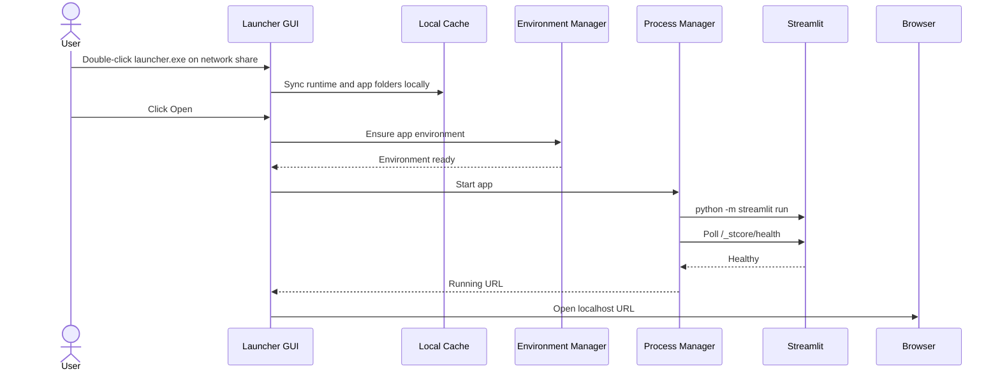
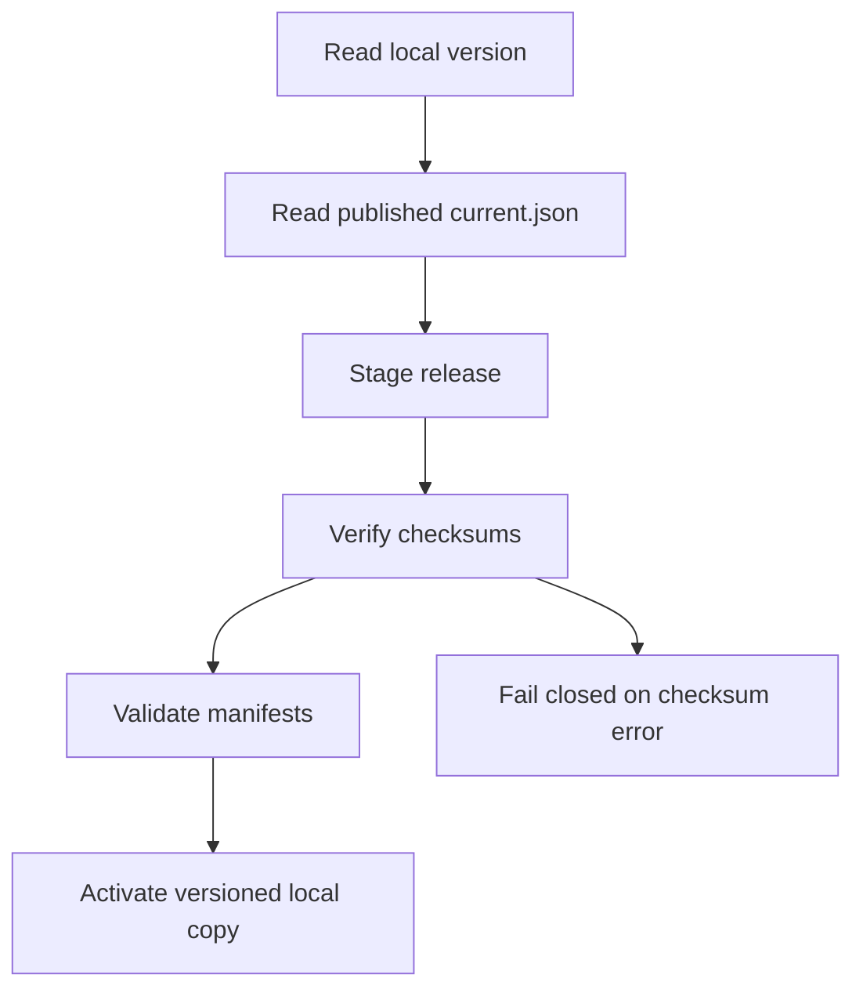
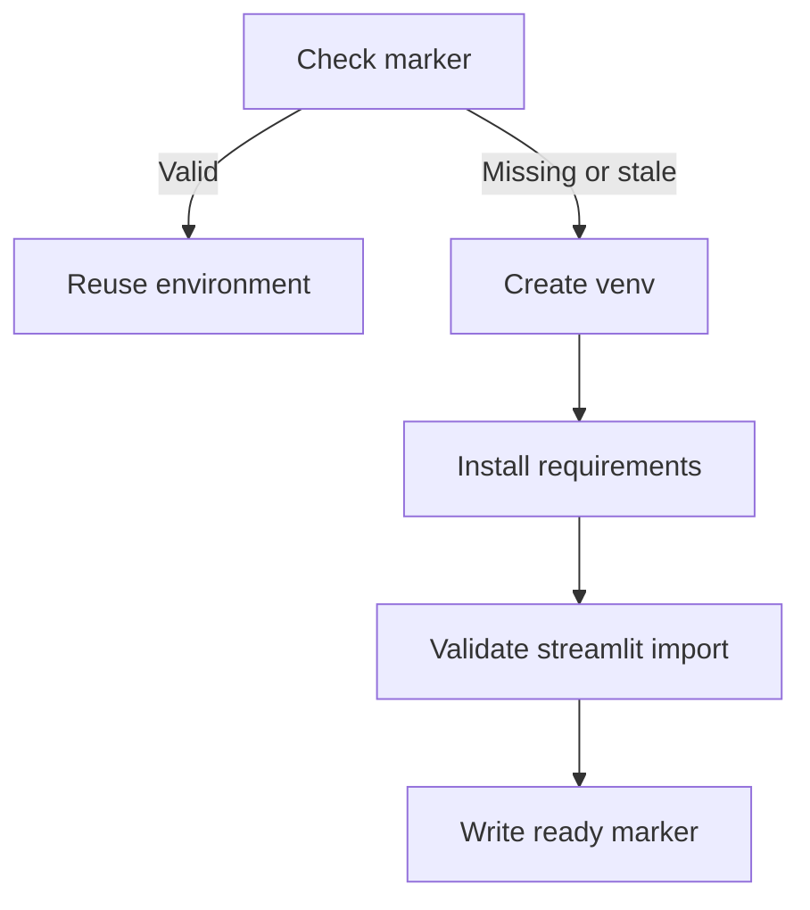
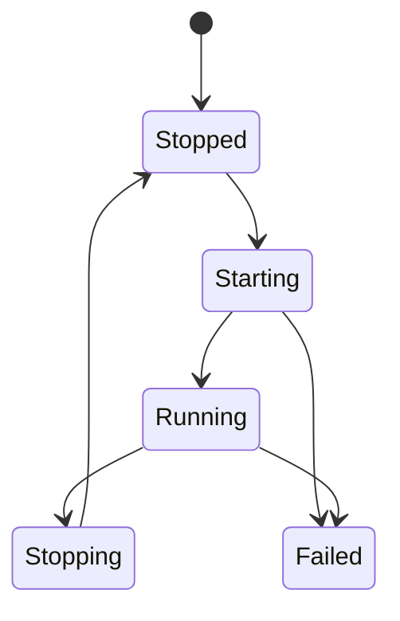

# Architecture

## High-Level Runtime

## Network Drive, Many Users

The network share is the read-only distribution source. Each user machine receives its own local copy of the portable runtime, app source folders, virtual environments, logs, and state under `%LOCALAPPDATA%`.

## Launch Sequence

