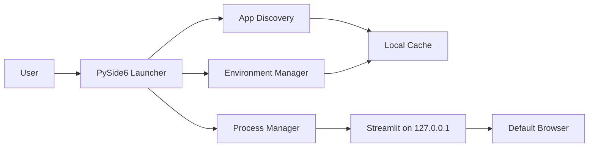
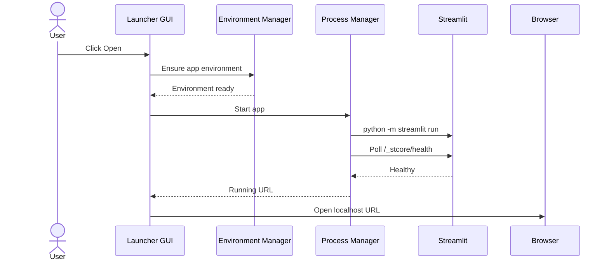
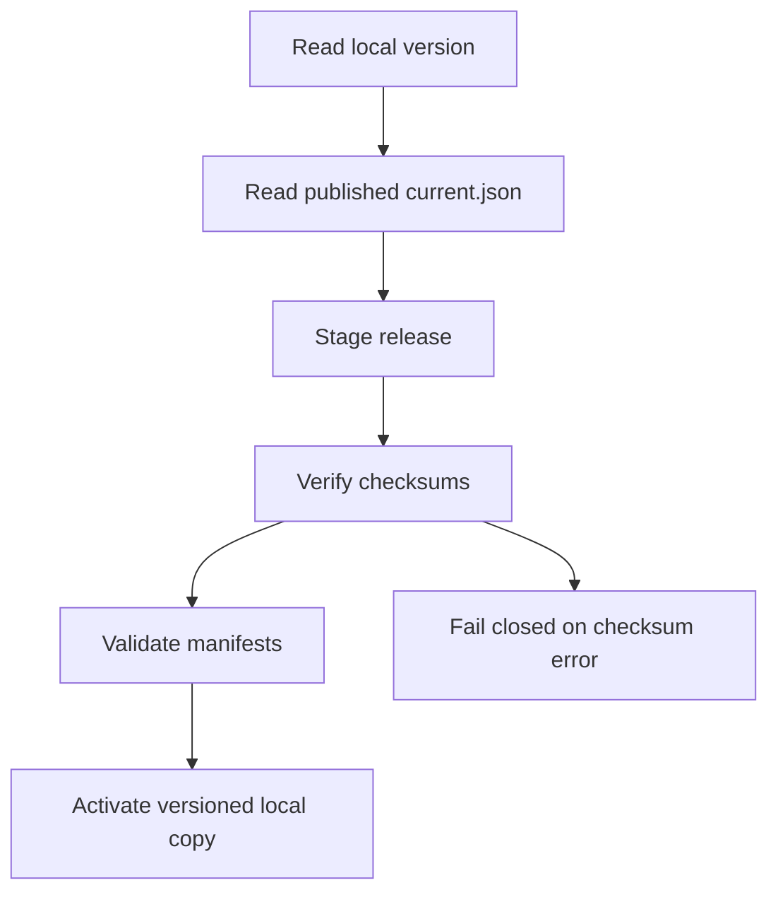
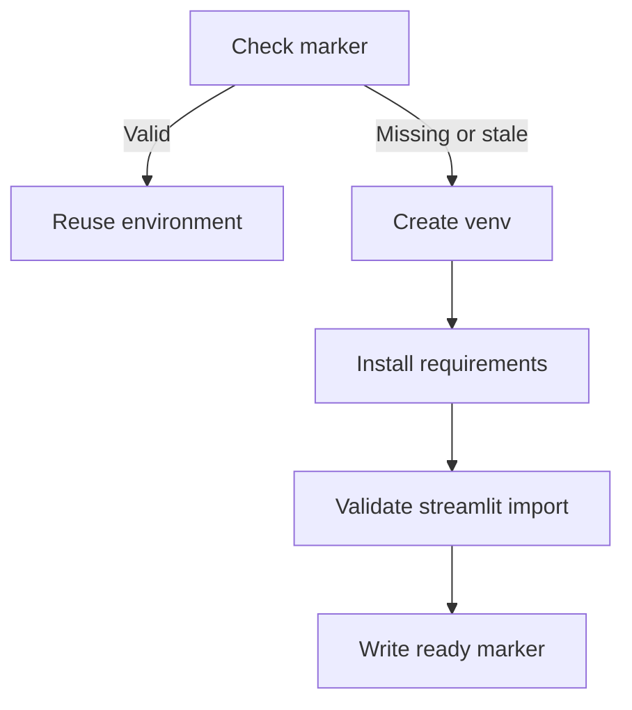
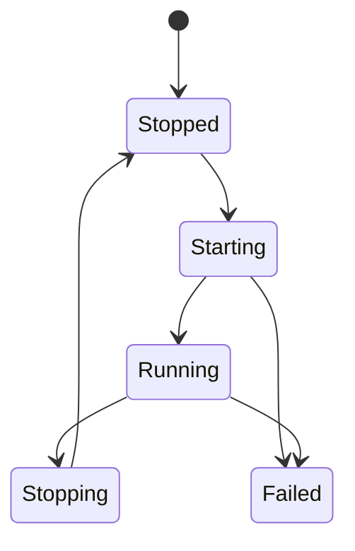

# Architecture

```mermaid
flowchart LR
    User["User"] --> GUI["PySide6 Launcher"]
    GUI --> Discovery["App Discovery"]
    GUI --> Env["Environment Manager"]
    GUI --> PM["Process Manager"]
    Discovery --> Cache["Local App Cache"]
    Env --> Cache["Local Cache"]
    PM --> Streamlit["Streamlit on 127.0.0.1"]
    Streamlit --> Browser["Default Browser"]
```

```mermaid
sequenceDiagram
    actor User
    participant GUI as Launcher GUI
    participant EM as Environment Manager
    participant PM as Process Manager
    participant ST as Streamlit
    participant Browser
    User->>GUI: Click Open
    GUI->>EM: Ensure app environment
    EM-->>GUI: Environment ready
    GUI->>PM: Start app
    PM->>ST: python -m streamlit run
    PM->>ST: Poll /_stcore/health
    ST-->>PM: Healthy
    PM-->>GUI: Running URL
    GUI->>Browser: Open localhost URL
```

```mermaid
flowchart TD
    A["Read local version"] --> B["Read published current.json"]
    B --> C["Stage release"]
    C --> D["Verify checksums"]
    D --> E["Validate manifests"]
    E --> F["Activate versioned local copy"]
    D --> G["Fail closed on checksum error"]
```

```mermaid
flowchart TD
    A["Check marker"] -->|Valid| B["Reuse environment"]
    A -->|Missing or stale| C["Create venv"]
    C --> D["Install requirements"]
    D --> E["Validate streamlit import"]
    E --> F["Write ready marker"]
```

```mermaid
stateDiagram-v2
    [*] --> Stopped
    Stopped --> Starting
    Starting --> Running
    Starting --> Failed
    Running --> Stopping
    Stopping --> Stopped
    Running --> Failed
```
